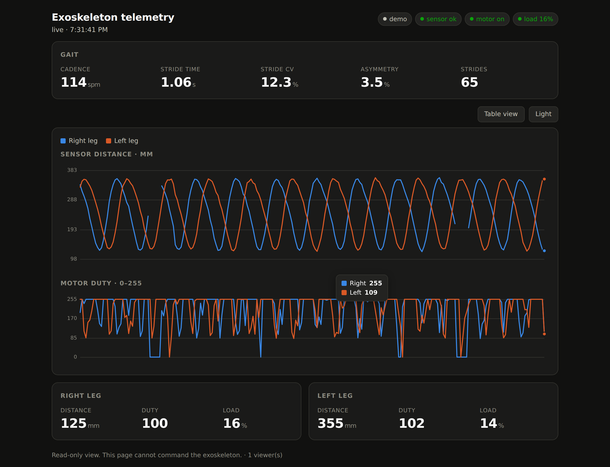

# exo-telemetry-tunnel

[](https://github.com/falakpat3l/exo-telemetry-tunnel/actions/workflows/ci.yml)

A read-only telemetry bridge for the [StrideMate walking-assist exoskeleton](https://github.com/falakpat3l/stridemate-exoskeleton). It takes the exoskeleton's live data, derives gait metrics from it, serves a dashboard, and — with one command — puts that dashboard on a public HTTPS URL so a supervisor, a clinician or an interviewer can watch a session from anywhere.

**It runs with no hardware.** `python -m exotel --demo` synthesises a plausible gait signal, dropouts and all, so you can clone this and see the whole thing working in about ten seconds.



## Quick start

```bash
git clone https://github.com/falakpat3l/exo-telemetry-tunnel.git
cd exo-telemetry-tunnel
python3 -m exotel --demo
```

Open the URL it prints. No dependencies — Python 3.10+ and the standard library, nothing else. The exoskeleton's own firmware avoids external libraries on principle, and this follows the same rule.

To share it:

```bash
./tunnel.sh --demo
```

That starts the dashboard and a [Cloudflare quick tunnel](https://try.cloudflare.com/) in front of it, then prints an `https://something.trycloudflare.com/?k=...` link. No Cloudflare account, no DNS, no port forwarding, no router config. The tunnel dies with the process. You need [`cloudflared`](https://github.com/cloudflare/cloudflared/releases) installed (`brew install cloudflared` on macOS); if `qrencode` is around, you also get a QR code to point a phone at.

## Against the real device

```bash
python -m exotel --source http://10.210.60.121 \
                 --user stridemate --password <dashboard password> \
                 --record session.jsonl
```

It polls the right leg's `/data` endpoint — the one that already carries both legs. `--record` writes every frame as JSON lines, which you can play back later:

```bash
python -m exotel --source session.jsonl        # loops at the original speed
python -m exotel --source sample/session.jsonl --speed 2
```

A 20-second sample recording is in `sample/` so replay works straight from a clone.

## What it measures

Everything comes out of one channel per leg: the distance the time-of-flight sensor reports, in millimetres. As the leg swings, that number oscillates, and the stride events are the crossings of its own midline.

| Metric | Why it is here |
|---|---|
| **Stride time** | seconds between successive peaks on one leg |
| **Cadence** | steps per minute (two steps per stride, so 120 / stride time) |
| **Stride CV** | stride-time variability as a coefficient of variation — the gait measure with the strongest clinical literature behind it, and a documented correlate of fall risk |
| **Asymmetry** | difference in stride time between the legs, over their mean — the thing an assistive device is supposed to reduce |
| **Excursion** | peak-to-trough range, a proxy for range of motion |

Stride detection is a Schmitt trigger on the midline with hysteresis scaled to the signal's own amplitude. Deliberately simple: anything cleverer would need per-user, per-placement tuning, and would be harder to defend than "these are the peak times and this is the arithmetic on them".

Three behaviours are worth stating because they are the ones that quietly go wrong:

- **A lost target is `null`, never 0 mm.** Feeding a dropout in as zero would fake a 250 mm swing and a stride that never happened. Every layer — source, tracker, chart — treats absence as absence. The demo generates dropouts on purpose so this path is exercised on every run.
- **A still leg reports no strides**, rather than manufacturing them out of sensor noise.
- **Nothing is reported until it means something.** Asymmetry stays at 0.0 until both legs have six confident strides, instead of showing a number computed from two samples.

## It cannot control the exoskeleton

There is no route in this server that reaches back to the device. `HttpSource` fetches `/data` and nothing else, and the smoke test asserts that `/motor`, `/stop` and `/setPWM` all return 404.

That is the point of the design rather than an omission. The whole purpose here is to put a live feed behind a public URL, and a public URL that can start an actuator strapped to someone's leg is not a thing worth building. If you want to change assist strength, use the dashboard on the ESP32 itself, on the local network.

## The token

A Cloudflare quick tunnel is genuinely public. The hostname is random, but random is not secret, and it is served to the open internet.

So every request needs a token. One is generated per run and printed with the URL; pass `--token` to set your own. Treat the link like a password — anyone holding it can watch the feed. Both the tunnel and the token disappear when you stop the process.

## Layout

```
exotel/
  __main__.py     CLI
  sources.py      demo generator, live HTTP poller, .jsonl replay
  gait.py         stride detection and metrics
  server.py       token gate, SSE stream, static page
  web/index.html  the dashboard (one file, no CDN)
tunnel.sh         start the dashboard behind a Cloudflare quick tunnel
scripts/
  smoke_test.py   end-to-end: server starts, token holds, frames flow
tests/            unit tests for the gait maths and the sources
sample/           a recorded session, for replay without hardware
```

## Tests

```bash
python -m unittest discover -s tests -t . -v
python scripts/smoke_test.py
```

The gait tests check the tracker recovers a stride time it was given, that a still leg produces nothing, and that dropouts do not shift the answer. The smoke test starts a real server and checks the token gate, the SSE stream, and the absence of any control route.

## Notes and limits

- **Sample rate bounds variability resolution.** Stride CV is computed from peak *times*, so the sampling interval quantises it. At 20 Hz a 1.1 s stride is resolved to about ±2%; if you care about CV specifically, raise `--rate` and the sensor's timing budget together.
- **One channel is one channel.** Swing/stance split, joint angles and ground contact are not recoverable from a single distance trace. They would need the IMU, and the exoskeleton currently reads its gyro and throws it away.
- **The demo is a model, not data.** It is there so the project runs and the code paths are exercised, not to stand in for a measurement.
- **`Origin` checks on the exoskeleton.** Recent StrideMate firmware rejects cross-origin requests on its control endpoints. That does not affect this bridge, which only reads `/data`, but it does mean you cannot proxy the exoskeleton's *own* dashboard through a tunnel without relaxing that check deliberately.

## Licence

**[PolyForm Noncommercial License 1.0.0](LICENSE.md)** — free for personal,
research, educational, charitable and government use; commercial use needs a
separate licence from the copyright holder.

Not an OSI-approved open-source licence, because no OSI-approved licence
restricts commercial use. The exoskeleton firmware it pairs with is under the
same terms; the mechanical CAD is under CC BY-NC-SA 4.0.
